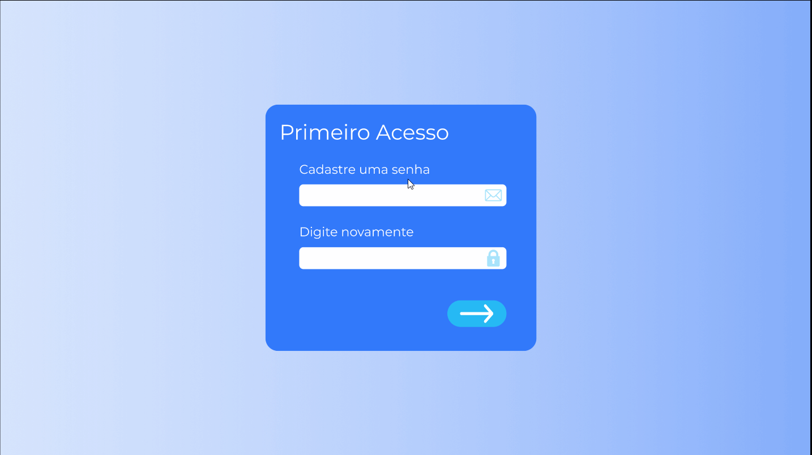

# SISATAS

### Uma solução web para acompanhamento e gerenciamento de atas de reuniões.

<br>

<div align="center">


Desenvolvido pela bureau tech.

</div>

<br>

## Protótipo das telas da aplicação



<br>

Protótipo interativo das telas está disponível neste link: https://bit.ly/SISATAS

<br>

# Tecnologias

- Spring Framework
- Maven
- ReactJS
- Material-UI

</br>

# Como executar

## Servidor

Na pasta [***server/sisata***](./server/sisata): </br></br>

Pode ser executado diretamente utilizando o comando Maven abaixo:

```
mvn spring-boot:run
```

e ficará disponível em [localhost:8080](http://localhost/8080)

ou

1. Criação da Imagem do Docker::

```
docker build -t bureau/sisata
```

1. Para execução do container:

```
docker run -p 8080:8080 {image-id}
```


## Cliente

Na pasta [***client/***](./client): </br></br>

1. Faça a instalação dos módulos:
   
```
npm install
```

2. Inicie a aplicação: 

```
npm start
```
</br>

Ficará disponível em [localhost:3000](http://localhost/3000)

</br>

# Progress
## Sprint 1
### Prototypes
Interactive screen prototypes can be found here: https://bit.ly/SISATAS

</br>

### Documentation
- [Project Backlog](https://github.com/BureauTech/ProjectSisatas/blob/feature/readme/docs/Product%20Backlog%20-%20SISATAS.pdf)
- [Entity Relationship (DER)(Conceptual)](https://github.com/BureauTech/ProjectSisatas/blob/master/docs/DER_Conceitual_SISATA_Final.png)
- [Entity Relationship (DER)(Logical)](https://github.com/BureauTech/ProjectSisatas/blob/master/docs/DER_Logico_SISATA_Final.png)
- [Use Case Diagram (DCU)](https://github.com/BureauTech/ProjectSisatas/blob/feature/readme/docs/Product%20Backlog%20-%20SISATAS.pdf)
- [Screen's Prototypes](https://github.com/BureauTech/ProjectSisatas/blob/prod/sprint-1/docs/Prototipo_telas_v1.pdf) 

</br>

### Server
Created .xlsx minute template.
Implementation of the excel export functionality, although with a enconging bug that is planned
to be solved on the next Sprint.


</br>

### Client
Created .html template. 
Testing with button that calls the browser's printing function.


# Authors

### [](https://github.com/bibiacoutinho) - Master <br>

### [](https://github.com/charles-ramos) - PO <br>

### [](https://github.com/anaclaragraciano) - DEV Team <br>

### [](https://github.com/caiquesjc) - DEV Team <br>

### [](https://github.com/danielsantosoliveira) - DEV Team<br>

### [](https://github.com/Denis-Lima) - DEV Team <br>

### [](https://github.com/JoaoPSPereira) - DEV Team <br>

### [](https://github.com/WeDias) - DEV Team <br>


